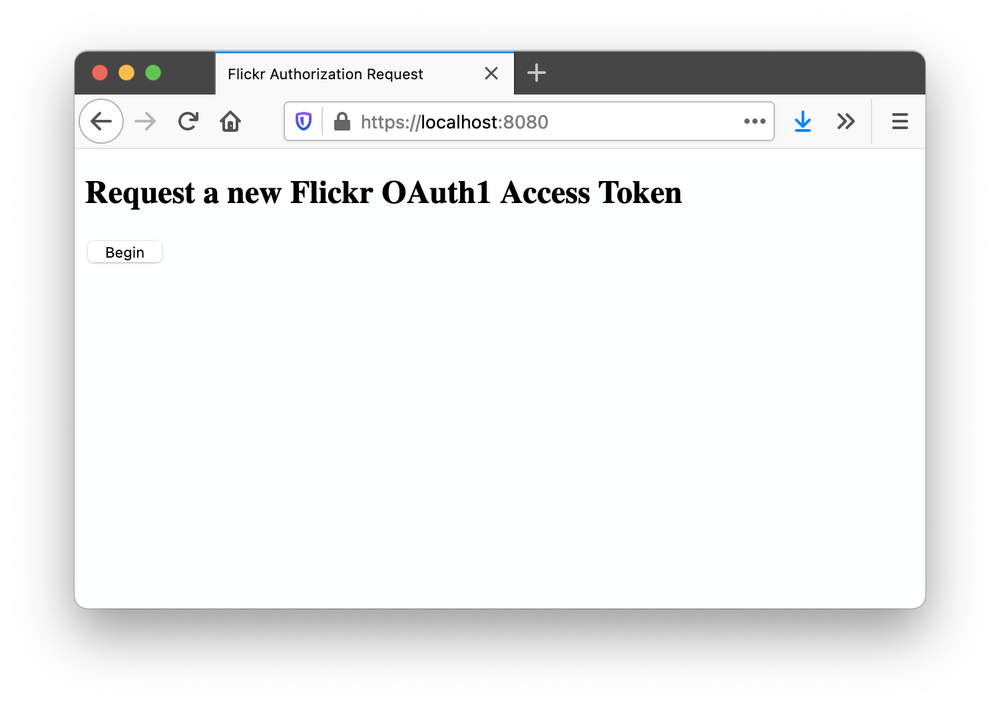
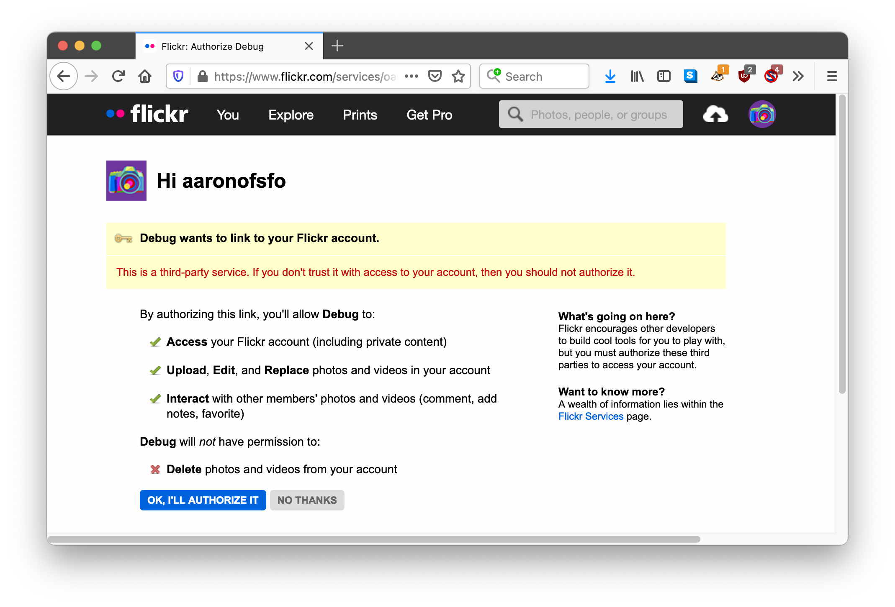
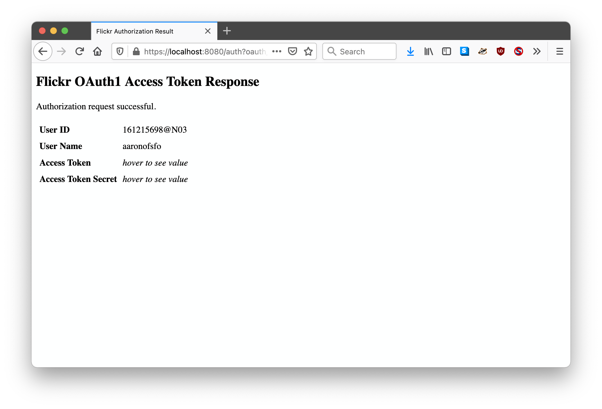

# go-flickr-api

Go package for working with the Flickr API
 
## Documentation

[](https://pkg.go.dev/github.com/aaronland/go-flickr-api)

### Example

```
package main

import (
	"context"
	"github.com/aaronland/go-flickr-api/client"
	"io"
	"net/url"
	"os"
)

func main() {

	ctx := context.Background()

	client_uri := "oauth1://?consumer_key={KEY}&consumer_secret={SECRET}&oauth_token={TOKEN}&oauth_token_secret={SECRET}"
	cl, _ := client.NewClient(ctx, client_uri)

	args := &url.Values{}
	args.Set("method", "flickr.test.login")

	fh, _ := cl.ExecuteMethod(ctx, args)
	defer fh.Close()
	
	io.Copy(os.Stdout, fh)
}
```

_Error handling removed for the sake of brevity._

## Design

The core of this package's approach to the Flickr API is the `ExecuteMethod` method (which is defined in the `client.Client` interface) whose signature looks like this:

```
	ExecuteMethod(context.Context, *url.Values) (io.ReadSeekCloser, error)
```

This package only defines [a handful of Go types or structs mapping to individual API responses](response). So far these are all specific to operations relating to uploading or replacing photos and to pagination.

In time there may be, along with helper methods for unmarshaling API responses in to typed responses but the baseline for all operations will remain: Query paramters (`url.Values`) sent over HTTP returning an `io.ReadSeekCloser` instance that is inspected and validated according to the needs and uses of the tools using the Flickr API.

## Clients

The `client.Client` interface provides for common methods for accessing the Flickr API. Currently there is only a single client interface that calls the Flickr API using the OAuth1 authentication and authorization scheme but it is assumed that eventually there will be at least one other when OAuth1 is superseded.

Clients are instantiated using a URI-based syntax where the scheme and query parameters map to specific implementation details.

### OAuth1

The OAuth1 `Client` implementation is instantiated using the `oauth1://` scheme. For example:

```
oauth1://?{QUERY_PARAMETERS}
```

Valid query parameters are:

| Name | Value | Required |
| --- | --- | --- |
| `consumer_key` | string | yes |
| `consumer_secret` | string | yes |
| `oauth_token` | string | no |
| `oauth_token_secret` | string | no |

## Tools

This package comes with a series of opinionated applications to implement functionality exposed by the Flickr API. These easiest way to build them is to run the handy `cli` target in the Makefile that comes bundled with this package.

```
$> make cli
go build -mod vendor -o bin/api cmd/api/main.go
go build -mod vendor -o bin/upload cmd/upload/main.go
go build -mod vendor -o bin/replace cmd/replace/main.go
go build -mod vendor -o bin/auth-cli cmd/auth-cli/main.go
go build -mod vendor -o bin/auth-www cmd/auth-www/main.go
```

### api

Command-line tool for invoking the Flickr API. Results are emitted to STDOUT.

```
$> ./bin/api -h
Command-line tool for invoking the Flickr API. Results are emitted to STDOUT.

Usage:
	./bin/api [options]

Valid options are:
  -client-uri string
    	A valid aaronland/go-flickr-api client URI.
  -paginated
    	Automatically paginate (and iterate through) all API responses.
  -param value
    	Zero or more {KEY}={VALUE} Flickr API parameters to include with your uploads.
  -use-runtimevar
    	Signal that the -client-uri flag is encoded as a gocloud.dev/runtimevar string URI.

Notes:

Uploading and replacing images are not supported by this tool. You can use the
'upload' and 'replace' tools, respectively, for those tasks.
```

For example:

```
$> ./bin/api \
	-client-uri 'oauth1://?consumer_key={KEY}&consumer_secret={SECRET}&oauth_token={TOKEN}&oauth_token_secret={SECRET}' \
	-param method=flickr.test.login \

| jq

{
  "user": {
    "id": "123456789@X03",
    "username": {
      "_content": "example"
    },
    "path_alias": null
  },
  "stat": "ok"
}
```

### auth-cli

Command-line tool for initiating a Flickr API authorization flow.

```
$> ./bin/auth-cli -h
Command-line tool for initiating a Flickr API authorization flow.

Usage:
	./bin/auth-cli [options]

Valid options are:
  -client-uri string
    	A valid aaronland/go-flickr-api client URI.
  -permissions string
    	A valid Flickr API permissions flag.
  -server-uri string
    	A valid aaronland/go-http-server URI.
  -use-runtimevar
    	Signal that the -client-uri flag is encoded as a gocloud.dev/runtimevar string URI.

Notes:

If you are running this application on localhost and are not using a 'tls://'
server-uri flag (including your own TLS key and certificate) you will need to
specify the 'mkcert://' server-uri flag and ensure that you have the
https://github.com/FiloSottile/mkcert tool installed on your computer. This is
because Flickr will automatically rewrite authorization callback URLs starting
in 'http://' to 'https://' even if those URLs are pointing back to localhost.
```

For example:

```
$> ./bin/auth-cli \
	-server-uri 'mkcert://localhost:8080' \
	-client-uri 'oauth1://?consumer_key={KEY}&consumer_secret={SECRET}'
	
2021/03/31 22:47:08 Checking whether mkcert is installed. If it is not you may be prompted for your password (in order to install certificate files
2021/03/31 22:47:09 Listening for requests on https://localhost:8080
2021/03/31 22:47:13 Authorize this application https://www.flickr.com/services/oauth/authorize?oauth_token={TOKEN}&perms=read

...Visit web browser, approve request, return to command-line to see:

{"oauth_token":"{TOKEN}","oauth_token_secret":"{SECRET}"}
```

### auth-www

HTTP server for initiating a Flickr API autorization flow in a web browser.

```
$> ./bin/auth-www -h
HTTP server for initiating a Flickr API autorization flow in a web browser.

Usage:
	./bin/auth-www [options]

Valid options are:
  -client-uri string
    	A valid aaronland/go-flickr-api client URI.
  -collection-uri string
    	A valid gocloud.dev/docstore URI. The docstore is used to store token requests during the time a user is approving an authentication request.
  -permissions string
    	A valid Flickr API permissions flag.
  -server-uri string
    	A valid aaronland/go-http-server URI.
  -use-runtimevar
    	Signal that the -client-uri flag is encoded as a gocloud.dev/runtimevar string URI.

Notes:

If you are running this application on localhost and are not using a 'tls://'
server-uri flag (including your own TLS key and certificate) you will need to
specify the 'mkcert://' server-uri flag and ensure that you have the
https://github.com/FiloSottile/mkcert tool installed on your computer. This is
because Flickr will automatically rewrite authorization callback URLs starting
in 'http://' to 'https://' even if those URLs are pointing back to localhost.
```

For example:

```
$> ./bin/auth-www \
	-permissions write \
	-server-uri 'mkcert://localhost:8080' \
	-collection-uri 'mem://collection/Token' \
	-client-uri file:///usr/local/flickr/client.txt \
	-use-runtimevar

2021/04/14 10:58:36 Checking whether mkcert is installed. If it is not you may be prompted for your password (in order to install certificate files
2021/04/14 10:58:38 Listening for requests on https://localhost:8080
```

_Note the use of the `-use-runtimevar` flag and the `file://` syntax for the `-client-uri` flag. This allows us to store credentials for the Flickr API client in a [GoCloud runtimevar](https://gocloud.dev/howto/runtimevar/) resource and not expose them on the command-line. Details are discussed below in the [Design](https://github.com/aaronland/go-flickr-api#design-1) section._

If you open the URL `https://localhost:8080` in your web browser you'll see a simple web page with a button for starting the Flickr authorization process.



Clicking the button will take you to Flickr where you'll be prompted to approve the authorization request.



Once you do you'll be redirected back to the website hosted on `localhost:8080` which will complete the the OAuth1 access token authorization process. The access token and secret will be included, but hidden by default, on the final webpage.



_You should think of the `auth-www` tool as a sample application, or at best a helper utility, for creating OAuth1 access tokens on behalf of a user rather than a drop-in widget for a more sophisticated application._

### upload

Command-line tool for uploading an image to Flickr.

```
$> ./bin/upload -h
Command-line tool for uploading one or more images to Flickr.

Usage:
	./bin/upload [options] path(N) path(N)

Valid options are:
  -client-uri string
    	A valid aaronland/go-flickr-api client URI.
  -param value
    	Zero or more {KEY}={VALUE} Flickr API parameters to include with your uploads.
  -use-runtimevar
    	Signal that the -client-uri flag is encoded as a gocloud.dev/runtimevar string URI.

Notes:

Under the hood the upload tool is using the GoCloud blob abstraction layer for
reading files. By default only local files the file:// URI scheme are supported.
If you need to read files from other sources you will need to clone this
application and import the relevant packages. As a convenience if no URI scheme
is included then each path will be resolved to its absolute URI and prepended
with file://.
```

For example, here's what would happen if you tried to upload an image using a client URI that _does not_ have an associated auth token (and secret):

```
$> bin/upload \
	-client-uri file:///usr/local/flickr/client.txt \
	-use-runtimevar \
	/usr/local/flickr/camera.png

| jq

[
  {
    "path": "/usr/local/flickr/camera.png",
    "error": "Failed to upload image '/usr/local/flickr/camera.png', API call failed with status '401 Unauthorized'"
  }
]
```

And here's an example of a successful upload:

```
$> bin/upload \
	-client-uri file:///usr/local/flickr/client-with-auth-token.txt \
	-use-runtimevar \
	/usr/local/flickr/camera.png

| jq

[
  {
    "path": "/Users/asc/Desktop/camera.png",
    "photoid": 51105221286
  }
]
```

### replace

Command-line tool for replacing an image in Flickr.

```
$> ./bin/replace -h
Command-line tool for replacing an image in Flickr.

Usage:
	./bin/replace [options] path(N) path(N)

Valid options are:
  -client-uri string
    	A valid aaronland/go-flickr-api client URI.
  -param value
    	Zero or more {KEY}={VALUE} Flickr API parameters to include with your uploads.
  -use-runtimevar
    	Signal that the -client-uri flag is encoded as a gocloud.dev/runtimevar string URI.

Notes:

Under the hood the replace tool is using the GoCloud blob abstraction layer for
reading files. By default only local files the file:// URI scheme are supported.
If you need to read files from other sources you will need to clone this
application and import the relevant packages. As a convenience if no URI scheme
is included then each path will be resolved to its absolute URI and prepended
with file://.
```

For example:

```
$> bin/replace \
	-client-uri file:///usr/local/flickr/client-with-auth-token.txt \
	-use-runtimevar \
	-param photo_id=51111590154
	/usr/local/flickr/cat.png

{
  "stat": "ok",
  "photo": {
    "id": 51111590154,
    "secret": "ba5d1012c3",
    "originalsecret": "67d1175ea0"
  }
}
```

### Design

The guts of all the tools bundled with this package are kept in the [application](application) directory rather than in application code itself. That's because the tools rely on the [GoCloud](https://gocloud.dev/) APIs for specific functionality. These are:

* Reading sensitive configuration data using the [runtimevar](https://gocloud.dev/howto/runtimevar/) abstraction layer.
* Reading images to upload or replace using the [blob](https://gocloud.dev/howto/blob/) abstraction layer.
* Persisting client authorization details (like request tokens) between stateless HTTP requests using the [docstore](https://gocloud.dev/howto/docstore/) abstraction layer.

Rather than bundling the code for all the services that the `GoCloud` APIs support the core of the application code only knows to expect _implementations_ of the relevant interfaces. It is expected that the application code itself (the code defined in `cmd/SOMEAPPLICATION`) will import the necessary packages for supporting a service-specific implementation.

For example, here's what the code for the [cmd/api](cmd/api/main.go) tool looks like:

```
package main

import (
	"context"
	"github.com/aaronland/go-flickr-api/application/api"
	_ "gocloud.dev/runtimevar/constantvar"
	_ "gocloud.dev/runtimevar/filevar"
	"log"
)

func main() {

	ctx := context.Background()

	app := &api.APIApplication{}
	_, err := app.Run(ctx)

	if err != nil {
		log.Fatalf("Failed to run upload application, %v", err)
	}
}
```

This version of the application supports reading client configuration using the `runtimevar` package's [constant://](https://gocloud.dev/howto/runtimevar/#local) and [file://](https://gocloud.dev/howto/runtimevar/#local) schemes. For example:

```
$> bin/api -use-runtimevar -client-uri file:///path/to/client-uri.cfg -param method=flickr.test.echo
```

If you wanted a version of the `api` tool that supported reading client configuration stored in the Amazon Web Service's [Parameter Store](https://docs.aws.amazon.com/systems-manager/latest/userguide/systems-manager-parameter-store.html) secrets manager you would rewrite the application like this:

```
package main

import (
	"context"
	"github.com/aaronland/go-flickr-api/application/api"
	_ "gocloud.dev/runtimevar/awsparamstore"
	"log"
)

func main() {

	ctx := context.Background()

	app := &api.APIApplication{}
	_, err := app.Run(ctx)

	if err != nil {
		log.Fatalf("Failed to run upload application, %v", err)
	}
}
```

And then invoke it like this:

```
$> bin/api -use-runtimevar -client-uri 'awsparamstore://{NAME}?region={REGION}&decoder=string' -param method=flickr.test.echo
```

The only thing that changes is the `runtimevar` package that your code imports. The rest of the application is encapsulated in the `APIApplication` instance.

## See also

* https://www.flickr.com/services/api/
* https://www.flickr.com/services/api/auth.oauth.html
* https://github.com/aaronland/go-http-server
* https://gocloud.dev/howto/docstore/
* https://gocloud.dev/howto/runtimevar/
* https://gocloud.dev/howto/blob/